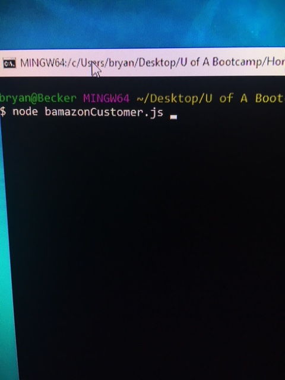
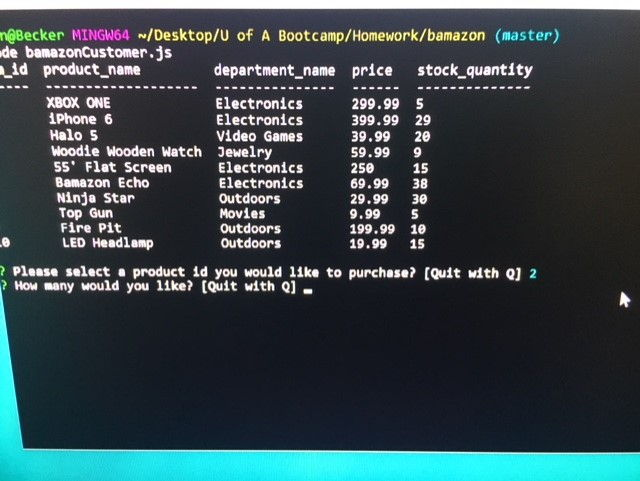
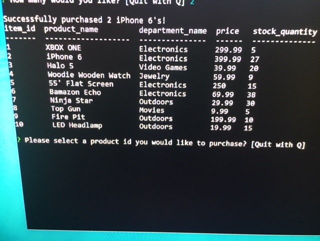
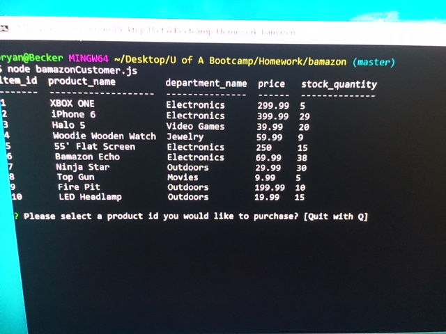

# Bamazon MarketPlace

Welcome to Bamazon Marketplace! As a customer You will be able to navigate the CLI to select not only the items you want but the quantity as well. This application is built using Node.js and MySQL. npm packages used for user interactivity, presentation, and functionality include: mySQL, inquirer, and console.table.

##Instructions:
Please clone the git repository and then open files in a text editor.
You will need to open bamazonCutomer.js and put your user password for MySQL and import the database.
Next, open up your terminal window and type the following: node bamazonCustomer.js

You can now purchase items from the Bamazon store front. You will need to choose items by their unique item_id and then select the quantity you would like to purchase.

It will then let you know if the purchase is successful and you can continue to shop Bamazon. At any time, you can cancel out of the store front by typing Q.

